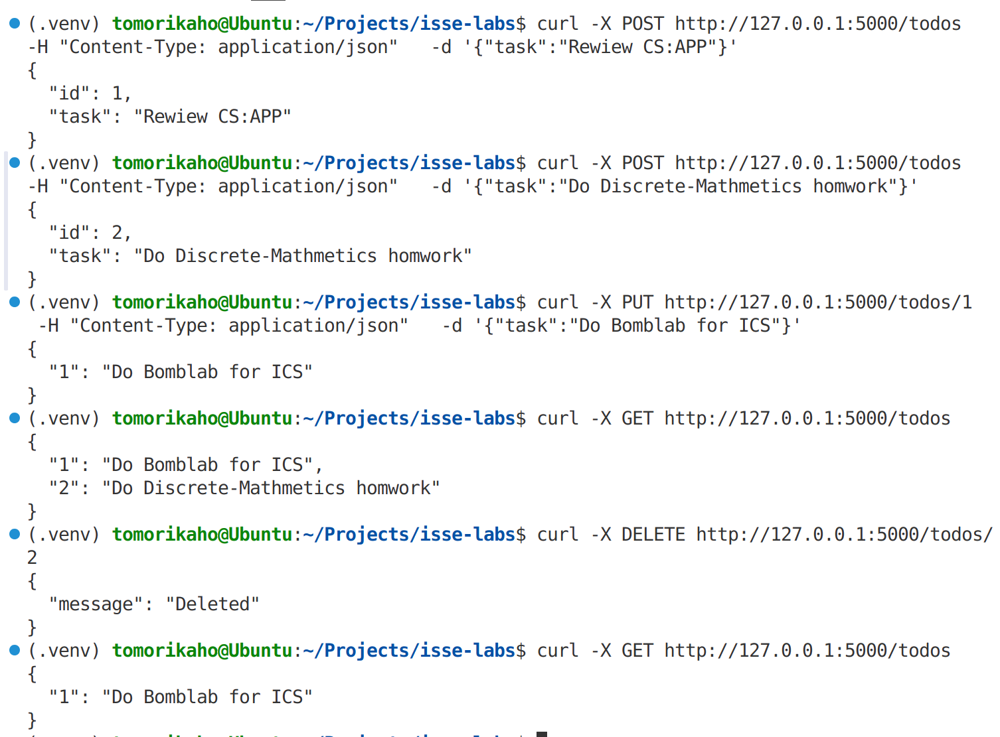

# RESTful API课堂作业

> Created by 封帆 2300018314

## 作业1 - 第三方API调用

调用百度地图API获取北京市海淀区天气信息，以JSON格式获取全部字段，输出到**lab2-doc/weather**。[查看运行结果](/lab2-doc/weather.json)

## 作业2 - 封装自己的API服务

基于Flask实现一个简单的TodoList增加、删除、查询、更新的API服务，curl运行结果示例如下图展示。


### 使用说明

#### 1.新增代办事项

- 方法：`POST`
- Endpoint: `/todos`
- 请求头：`Content-Type: application/json`
- 请求体（JSON）：

```json
{
    "task": "<任务描述>"
}
```

- 成功返回（201 Created）：新增项
  
```json
{
    "id": <任务id>, 
    "task": "<任务描述>"
}
```

- 失败返回（400 Bad Request）：缺少`task`参数

```json
{
    "error": "Task is required"
}
```

curl示例：

```bash
curl -X POST http://127.0.0.1:5000/todos -H "Content-Type: application/json" -d '{"task":"Review CS:APP"}'
```

#### 2.更新指定代办事项

- 方法：`PUT`
- Endpoint: `/todos/<id>`
- 请求头：`Content-Type: application/json`
- 请求体（JSON）：

```json
{
    "task": "<新的任务描述>"
}
```

- 成功返回（200 OK）：更新后的项
  
```json
{
    "<任务id>": "<新的任务描述>", 
}
```

- 失败返回：
  - 400 Bad Request（缺少`task`参数）
  
    ```json
    {
        "error": "Task is required"
    }
    ```
  
  - 404 Not Found（指定`id`不存在）

    ```json
    {
        "error": "Item not found"
    }
    ```

curl示例：

```bash
curl -X PUT http://127.0.0.1:5000/todos/1 -H "Content-Type: application/json" -d '{"task":"Do Bomblab"}'
```

#### 3.查询所有代办事项

- 方法：`GET`
- Endpoint: `/todos`
- 请求参数：无
- 返回值（200 OK）：含所有代办事项的JSON对象

```json
{
    "<id1>":"<任务描述1>",
    "<id2>":"<任务描述2>"
}
```

curl示例：

```bash
curl -X GET http://127.0.0.1:5000/todos
```

#### 4.删除指定代办事项

- 方法：`DELETE`
- Endpoint: `/todos/<id>`
- 请求参数：无
- 成功返回（200 OK）：

```json
{
    "message":"Deleted"
}
```

- 失败返回（404 Not Found）：指定id不存在
  
```json
{
    "error":"Item not found"
}
```

curl示例：

```bash
curl -X DELETE http://127.0.0.1:5000/todos/1
```
