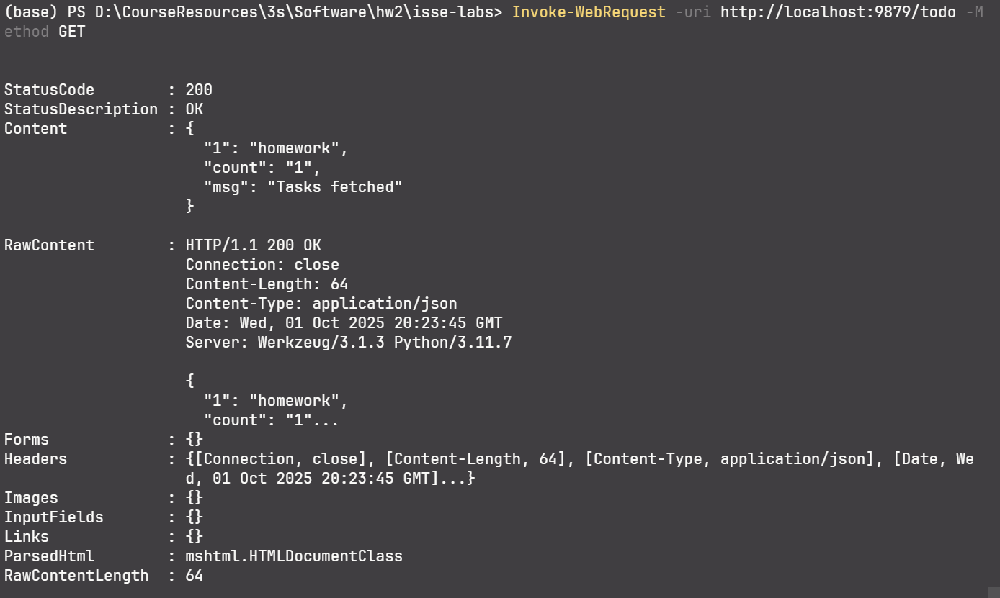

# note

## part1

结果

```text
(base) PS D:\CourseResources\3s\Software\hw2\isse-labs> & D:/ProgramData/anaconda3/python.exe d:/CourseResources/3s/Software/hw2/isse-labs/lab2-doc/张永康-2300017812/weather_client.py
{'status': 0, 'result': {'location': {'country': '中国', 'province': '四川省', 'city': '成都市', 'name': '成都', 'id': '510100'}, 'now': {'text': '多云', 'temp': 19, 'feels_like': 20, 'rh': 96, 'wind_class': '1级', 'wind_dir': '东风', 'prec_1h': 0.0, 'clouds': 79, 'vis': 30000, 'aqi': 30, 'pm25': 21, 'pm10': 28, 'no2': 11, 'so2': 4, 'o3': 41, 'co': 0.4, 'wind_angle': 82, 'uvi': 0, 'pressure': 949, 'dpt': 19, 'uptime': '20251002044000'}, 'indexes': [{'name': '晨练指数', 'brief': '较适宜', 'detail': '天气阴沉，请避免在林中晨练。'}, {'name': '洗车指数', 'brief': '较不适宜', 'detail': '三天内有雨，雨水和泥水会弄脏爱车。'}, {'name': '感冒指数', 'brief': '较易发', 'detail': '湿度大，较易感冒'}, {'name': '紫外线指数', 'brief': '强', 'detail': '涂擦 SPF20左右，PA++，避免强光。'}, {'name': '穿衣指数', 'brief': '热', 'detail': '适合穿T恤、短薄外套等夏季服装。'}, {'name': '运动指数', 'brief': '较适宜', 'detail': '请适当降低运动强度。'}], 'alerts': [{'type': '暴雨', 'level': '蓝色预警', 'title': '四川省气象台发布暴雨蓝色预警[IV级/一般]', 'desc': '四川省气象台2025年10月01日15 时40分发布暴雨蓝色预警：10月1日20时到2日20时：巴中、达州、南充、广安4市，遂宁、资阳2市东部有大雨到暴雨（雨量40～80毫米），局地大暴雨（雨量120～150毫米），最大小时雨强20～40毫米。相关区域请注意强降雨引发的小流域山洪、地质灾害、中小河流洪水等风险的发生，注意预防。'}], 'forecasts': [{'text_day': '多云', 'text_night': '多云', 'high': 27, 'low': 20, 'wc_day': '<3级', 'wd_day': '静风', 'wc_night': '<3级', 'wd_night': '静风', 'date': '2025-10-02', 'week': '星期四'}, {'text_day': '多云', 'text_night': '阴', 'high': 25, 'low': 20, 'wc_day': '<3级', 'wd_day': '静风', 'wc_night': '<3级', 'wd_night': '静风', 'date': '2025-10-03', 'week': '星期五'}, {'text_day': '小雨', 'text_night': '小雨', 'high': 24, 'low': 19, 'wc_day': '<3级', 'wd_day': '静风', 'wc_night': '<3级', 'wd_night': '静风', 'date': '2025-10-04', 'week': '星期六'}, {'text_day': '小雨', 'text_night': '小雨', 'high': 23, 'low': 19, 'wc_day': '<3级', 'wd_day': '静风', 'wc_night': '<3级', 'wd_night': '静风', 'date': '2025-10-05', 'week': '星期日'}, {'text_day': '多云', 'text_night': '小雨', 'high': 24, 'low': 20, 'wc_day': '<3级', 'wd_day': '静风', 'wc_night': '<3级', 'wd_night': '静风', 'date': '2025-10-06', 'week': '星期一'}, {'text_day': '阵雨', 'text_night': '小雨', 'high': 25, 'low': 20, 'wc_day': '<3级', 'wd_day': '静风', 'wc_night': '<3级', 'wd_night': '静风', 'date': '2025-10-07', 'week': '星期二'}, {'text_day': '小雨', 'text_night': '雨', 'high': 25, 'low': 16, 'wc_day': '<3级', 'wd_day': '南风', 'wc_night': '<3级', 'wd_night': '北风', 'date': '2025-10-08', 'week': '星期三'}], 'forecast_hours': [{'text': '阴', 'temp_fc': 19, 'wind_class': '<3级', 'wind_dir': '西风', 'rh': 97, 'prec_1h': 0.0, 'clouds': 80, 'wind_angle': 281, 'pop': 0, 'uvi': 0, 'pressure': 950, 'dpt': 19, 'data_time': '2025-10-02 04:00:00'}, {'text': '阴', 'temp_fc': 20, 'wind_class': '<3级', 'wind_dir': '西风', 'rh': 98, 'prec_1h': 0.0, 'clouds': 80, 'wind_angle': 279, 'pop': 0, 'uvi': 0, 'pressure': 950, 'dpt': 19, 'data_time': '2025-10-02 05:00:00'}, {'text': '阴', 'temp_fc': 20, 'wind_class': '<3级', 'wind_dir': '西风', 'rh': 98, 'prec_1h': 0.0, 'clouds': 80, 'wind_angle': 248, 'pop': 0, 'uvi': 0, 'pressure': 950, 'dpt': 19, 'data_time': '2025-10-02 06:00:00'}, {'text': '阴', 'temp_fc': 20, 'wind_class': '<3级', 'wind_dir': '西南风', 'rh': 98, 'prec_1h': 0.0, 'clouds': 80, 'wind_angle': 207, 'pop': 0, 'uvi': 0, 'pressure': 951, 'dpt': 19, 'data_time': '2025-10-02 07:00:00'}, {'text': '阴', 'temp_fc': 20, 'wind_class': '<3级', 'wind_dir': '南风', 'rh': 98, 'prec_1h': 0.0, 'clouds': 80, 'wind_angle': 178, 'pop': 0, 'uvi': 0, 'pressure': 952, 'dpt': 19, 'data_time': '2025-10-02 08:00:00'}, {'text': '阴', 'temp_fc': 21, 'wind_class': '<3级', 'wind_dir': '南风', 'rh': 89, 'prec_1h': 0.0, 'clouds': 67, 'wind_angle': 178, 'pop': 0, 'uvi': 0, 'pressure': 952, 'dpt': 19, 'data_time': '2025-10-02 09:00:00'}, {'text': '多云', 'temp_fc': 22, 'wind_class': '<3级', 'wind_dir': '南风', 'rh': 79, 'prec_1h': 0.0, 'clouds': 51, 'wind_angle': 177, 'pop': 0, 'uvi': 0, 'pressure': 952, 'dpt': 19, 'data_time': '2025-10-02 10:00:00'}, {'text': '多云', 'temp_fc': 24, 'wind_class': '<3级', 'wind_dir': '南风', 'rh': 71, 'prec_1h': 0.0, 'clouds': 38, 'wind_angle': 176, 'pop': 0, 'uvi': 0, 'pressure': 953, 'dpt': 18, 'data_time': '2025-10-02 11:00:00'}, {'text': '多云', 'temp_fc': 24, 'wind_class': '<3级', 'wind_dir': '南风', 'rh': 70, 'prec_1h': 0.0, 'clouds': 28, 'wind_angle': 162, 'pop': 0, 'uvi': 0, 'pressure': 952, 'dpt': 18, 'data_time': '2025-10-02 12:00:00'}, {'text': '多云', 'temp_fc': 24, 'wind_class': '<3级', 'wind_dir': '东南风', 'rh': 68, 'prec_1h': 0.0, 'clouds': 18, 'wind_angle': 149, 'pop': 0, 'uvi': 0, 'pressure': 951, 'dpt': 18, 'data_time': '2025-10-02 13:00:00'}, {'text': '多云', 'temp_fc': 25, 'wind_class': '3~4级', 'wind_dir': '东南风', 'rh': 68, 'prec_1h': 0.0, 'clouds': 10, 'wind_angle': 137, 'pop': 0, 'uvi': 0, 'pressure': 951, 'dpt': 18, 'data_time': '2025-10-02 14:00:00'}, {'text': '多云', 'temp_fc': 25, 'wind_class': '<3级', 'wind_dir': '东南风', 'rh': 69, 'prec_1h': 0.0, 'clouds': 10, 'wind_angle': 118, 'pop': 0, 'uvi': 0, 'pressure': 950, 'dpt': 19, 'data_time': '2025-10-02 15:00:00'}, {'text': '多云', 'temp_fc': 26, 'wind_class': '<3级', 'wind_dir': '东风', 'rh': 70, 'prec_1h': 0.0, 'clouds': 10, 'wind_angle': 90, 'pop': 0, 'uvi': 0, 'pressure': 950, 'dpt': 20, 'data_time': '2025-10-02 16:00:00'}, {'text': '多云', 'temp_fc': 27, 'wind_class': '<3级', 'wind_dir': '东风', 'rh': 72, 'prec_1h': 0.0, 'clouds': 10, 'wind_angle': 68, 'pop': 0, 'uvi': 0, 'pressure': 950, 'dpt': 21, 'data_time': '2025-10-02 17:00:00'}, {'text': '多云', 'temp_fc': 25, 'wind_class': '<3级', 'wind_dir': '东风', 'rh': 68, 'prec_1h': 0.0, 'clouds': 29, 'wind_angle': 82, 'pop': 0, 'uvi': 0, 'pressure': 950, 'dpt': 19, 'data_time': '2025-10-02 18:00:00'}, {'text': '多云', 'temp_fc': 24, 'wind_class': '<3级', 'wind_dir': '东风', 'rh': 64, 'prec_1h': 0.0, 'clouds': 50, 'wind_angle': 98, 'pop': 0, 'uvi': 0, 'pressure': 950, 'dpt': 17, 'data_time': '2025-10-02 19:00:00'}, {'text': '多云', 'temp_fc': 23, 'wind_class': '<3级', 'wind_dir': '东南风', 'rh': 61, 'prec_1h': 0.0, 'clouds': 70, 'wind_angle': 114, 'pop': 0, 'uvi': 0, 'pressure': 951, 'dpt': 15, 'data_time': '2025-10-02 20:00:00'}, {'text': '多 云', 'temp_fc': 22, 'wind_class': '<3级', 'wind_dir': '东南风', 'rh': 72, 'prec_1h': 0.0, 'clouds': 73, 'wind_angle': 142, 'pop': 0, 'uvi': 0, 'pressure': 951, 'dpt': 17, 'data_time': '2025-10-02 21:00:00'}, {'text': '多云', 'temp_fc': 22, 'wind_class': '<3级', 'wind_dir': '西南风', 'rh': 83, 'prec_1h': 0.0, 'clouds': 76, 'wind_angle': 245, 'pop': 0, 'uvi': 0, 'pressure': 951, 'dpt': 19, 'data_time': '2025-10-02 22:00:00'}, {'text': '多云', 'temp_fc': 22, 'wind_class': '<3级', 'wind_dir': '西风', 'rh': 96, 'prec_1h': 0.0, 'clouds': 79, 'wind_angle': 267, 'pop': 0, 'uvi': 0, 'pressure': 952, 'dpt': 21, 'data_time': '2025-10-02 23:00:00'}, {'text': '多云', 'temp_fc': 21, 'wind_class': '<3级', 'wind_dir': '西风', 'rh': 96, 'prec_1h': 0.0, 'clouds': 79, 'wind_angle': 253, 'pop': 0, 'uvi': 0, 'pressure': 952, 'dpt': 21, 'data_time': '2025-10-03 00:00:00'}, {'text': '多云', 'temp_fc': 21, 'wind_class': '<3级', 'wind_dir': '东南风', 'rh': 96, 'prec_1h': 0.0, 'clouds': 79, 'wind_angle': 126, 'pop': 0, 'uvi': 0, 'pressure': 952, 'dpt': 20, 'data_time': '2025-10-03 01:00:00'}, {'text': '多云', 'temp_fc': 21, 'wind_class': '<3级', 'wind_dir': '东风', 'rh': 97, 'prec_1h': 0.0, 'clouds': 79, 'wind_angle': 104, 'pop': 0, 'uvi': 0, 'pressure': 952, 'dpt': 20, 'data_time': '2025-10-03 02:00:00'}, {'text': '多云', 'temp_fc': 20, 'wind_class': '<3级', 'wind_dir': '东风', 'rh': 96, 'prec_1h': 0.0, 'clouds': 76, 'wind_angle': 76, 'pop': 0, 'uvi': 0, 'pressure': 951, 'dpt': 20, 'data_time': '2025-10-03 03:00:00'}]}, 'message': 'success'}
```

## part2

使用powershell环境所以默认使用的Invoke-WebRequest
截图：


以及一长串的请求：模拟了各种调用和边缘情况

```text
(base) PS D:\CourseResources\3s\Software\hw2\isse-labs> Invoke-WebRequest -uri http://localhost:9879/todo -Method GET                                                                                                   


StatusCode        : 200
StatusDescription : OK
Content           : {
                      "count": 0,
                      "msg": "Tasks fetched"
                    }

RawContent        : HTTP/1.1 200 OK
                    Connection: close
                    Content-Length: 43
                    Content-Type: application/json
                    Date: Wed, 01 Oct 2025 20:40:16 GMT
                    Server: Werkzeug/3.1.3 Python/3.11.7                                                                                                                                                                                    {                                                                                                             "count": 0,                                                                           
                      "msg": "Tasks fet...
Forms             : {}
Headers           : {[Connection, close], [Content-Length, 43], [Content-Type, application/json], [Date, We 
                    d, 01 Oct 2025 20:40:16 GMT]...}
Images            : {}
InputFields       : {}
Links             : {}
ParsedHtml        : mshtml.HTMLDocumentClass
RawContentLength  : 43


(base) PS D:\CourseResources\3s\Software\hw2\isse-labs> Invoke-WebRequest -uri http://localhost:9879/update -Method PUT -Body '{"id":2,"task":"another homework"}' -Headers @{ "Content-Type" = "application/json" }


StatusCode        : 200
StatusDescription : OK
Content           : {
                      "msg": "Task not found"
                    }

RawContent        : HTTP/1.1 200 OK
                    Connection: close
                    Content-Length: 30
                    Content-Type: application/json
                    Date: Wed, 01 Oct 2025 20:40:18 GMT
                    Server: Werkzeug/3.1.3 Python/3.11.7
                                                                                                                                {                                                                                                             "msg": "Task not found"                                                                                   }                                                                                       

Forms             : {}
Headers           : {[Connection, close], [Content-Length, 30], [Content-Type, application/json], [Date, We 
                    d, 01 Oct 2025 20:40:18 GMT]...}
Images            : {}
InputFields       : {}
Links             : {}
ParsedHtml        : mshtml.HTMLDocumentClass
RawContentLength  : 30


(base) PS D:\CourseResources\3s\Software\hw2\isse-labs> Invoke-WebRequest -uri http://localhost:9879/add -Method POST -Body '{"task":"homework"}' -Headers @{ "Content-Type" = "application/json" }                     


StatusCode        : 200
StatusDescription : OK
Content           : {
                      "id": 1,
                      "msg": "Task added",
                      "task": "homework"
                    }

RawContent        : HTTP/1.1 200 OK
                    Connection: close
                    Content-Length: 59
                    Content-Type: application/json
                    Date: Wed, 01 Oct 2025 20:40:23 GMT
                    Server: Werkzeug/3.1.3 Python/3.11.7                                                                                                                                                                                    {                                                                                                             "id": 1,                                                                              
                      "msg": "Task added",...
Forms             : {}
Headers           : {[Connection, close], [Content-Length, 59], [Content-Type, application/json], [Date, We 
                    d, 01 Oct 2025 20:40:23 GMT]...}
Images            : {}
InputFields       : {}
Links             : {}
ParsedHtml        : mshtml.HTMLDocumentClass
RawContentLength  : 59


(base) PS D:\CourseResources\3s\Software\hw2\isse-labs> Invoke-WebRequest -uri http://localhost:9879/add -Method POST -Body '{"task":"homework"}' -Headers @{ "Content-Type" = "application/json" }


StatusCode        : 200
StatusDescription : OK
Content           : {
                      "id": 2,
                      "msg": "Task added",
                      "task": "homework"
                    }

RawContent        : HTTP/1.1 200 OK
                    Connection: close
                    Content-Length: 59
                    Content-Type: application/json
                    Date: Wed, 01 Oct 2025 20:40:25 GMT
                    Server: Werkzeug/3.1.3 Python/3.11.7                                                                                                                                                                                    {                                                                                                             "id": 2,                                                                              
                      "msg": "Task added",...
Forms             : {}
Headers           : {[Connection, close], [Content-Length, 59], [Content-Type, application/json], [Date, We 
                    d, 01 Oct 2025 20:40:25 GMT]...}
Images            : {}
InputFields       : {}
Links             : {}
ParsedHtml        : mshtml.HTMLDocumentClass
RawContentLength  : 59


(base) PS D:\CourseResources\3s\Software\hw2\isse-labs> Invoke-WebRequest -uri http://localhost:9879/add -Method POST -Body '{}' -Headers @{ "Content-Type" = "application/json" }


StatusCode        : 200
StatusDescription : OK
Content           : {
                      "msg": "Task is required"
                    }

RawContent        : HTTP/1.1 200 OK
                    Connection: close
                    Content-Length: 32
                    Content-Type: application/json
                    Date: Wed, 01 Oct 2025 20:40:30 GMT
                    Server: Werkzeug/3.1.3 Python/3.11.7
                                                                                                                                {                                                                                                             "msg": "Task is required"                                                                                 }                                                                                       

Forms             : {}
Headers           : {[Connection, close], [Content-Length, 32], [Content-Type, application/json], [Date, We 
                    d, 01 Oct 2025 20:40:30 GMT]...}
Images            : {}
InputFields       : {}
Links             : {}
ParsedHtml        : mshtml.HTMLDocumentClass
RawContentLength  : 32


(base) PS D:\CourseResources\3s\Software\hw2\isse-labs> Invoke-WebRequest -uri http://localhost:9879/add -Method POST -Body '{"task":"homework"}' -Headers @{ "Content-Type" = "application/json" }


StatusCode        : 200
StatusDescription : OK
Content           : {
                      "id": 3,
                      "msg": "Task added",
                      "task": "homework"
                    }

RawContent        : HTTP/1.1 200 OK
                    Connection: close
                    Content-Length: 59
                    Content-Type: application/json
                    Date: Wed, 01 Oct 2025 20:40:33 GMT
                    Server: Werkzeug/3.1.3 Python/3.11.7                                                                                                                                                                                    {                                                                                                             "id": 3,                                                                              
                      "msg": "Task added",...
Forms             : {}
Headers           : {[Connection, close], [Content-Length, 59], [Content-Type, application/json], [Date, We 
                    d, 01 Oct 2025 20:40:33 GMT]...}
Images            : {}
InputFields       : {}
Links             : {}
ParsedHtml        : mshtml.HTMLDocumentClass
RawContentLength  : 59


(base) PS D:\CourseResources\3s\Software\hw2\isse-labs> Invoke-WebRequest -uri http://localhost:9879/update -Method PUT -Body '{"id":2,"task":"another homework"}' -Headers @{ "Content-Type" = "application/json" }


StatusCode        : 200
StatusDescription : OK
Content           : {
                      "2": "another homework",
                      "msg": "Task updated"
                    }

RawContent        : HTTP/1.1 200 OK
                    Connection: close
                    Content-Length: 55
                    Content-Type: application/json
                    Date: Wed, 01 Oct 2025 20:40:36 GMT
                    Server: Werkzeug/3.1.3 Python/3.11.7                                                                                                                                                                                    {                                                                                                             "2": "another homework",                                                              
                      "msg...
Forms             : {}
Headers           : {[Connection, close], [Content-Length, 55], [Content-Type, application/json], [Date, We 
                    d, 01 Oct 2025 20:40:36 GMT]...}
Images            : {}
InputFields       : {}
Links             : {}
ParsedHtml        : mshtml.HTMLDocumentClass
RawContentLength  : 55


(base) PS D:\CourseResources\3s\Software\hw2\isse-labs> Invoke-WebRequest -uri http://localhost:9879/delete -Method POST -Body '{"id":0}' -Headers @{ "Content-Type" = "application/json" }                             


StatusCode        : 200
StatusDescription : OK
Content           : {
                      "msg": "Id is required",
                      "task": ""
                    }

RawContent        : HTTP/1.1 200 OK
                    Connection: close
                    Content-Length: 44
                    Content-Type: application/json
                    Date: Wed, 01 Oct 2025 20:40:40 GMT
                    Server: Werkzeug/3.1.3 Python/3.11.7                                                                                                                                                                                    {                                                                                                             "msg": "Id is required",                                                              
                      "tas...
Forms             : {}
Headers           : {[Connection, close], [Content-Length, 44], [Content-Type, application/json], [Date, We 
                    d, 01 Oct 2025 20:40:40 GMT]...}
Images            : {}
InputFields       : {}
Links             : {}
ParsedHtml        : mshtml.HTMLDocumentClass
RawContentLength  : 44


(base) PS D:\CourseResources\3s\Software\hw2\isse-labs> Invoke-WebRequest -uri http://localhost:9879/delete -Method POST -Body '{"id":1}' -Headers @{ "Content-Type" = "application/json" }


StatusCode        : 200
StatusDescription : OK
Content           : {
                      "msg": "Task deleted",
                      "task": "homework"
                    }

RawContent        : HTTP/1.1 200 OK
                    Connection: close
                    Content-Length: 50
                    Content-Type: application/json
                    Date: Wed, 01 Oct 2025 20:40:46 GMT
                    Server: Werkzeug/3.1.3 Python/3.11.7

                    {
                      "msg": "Task deleted",
                      "task"...
Forms             : {}
Headers           : {[Connection, close], [Content-Length, 50], [Content-Type, application/json], [Date, We 
                    d, 01 Oct 2025 20:40:46 GMT]...}
Images            : {}
InputFields       : {}
Links             : {}
ParsedHtml        : mshtml.HTMLDocumentClass
RawContentLength  : 50


```

好心的助教的TodoList成功模拟了多人合作时对方写的代码不规范的情况，包括但不限于使用int作为索引、基于条件的不返回结果
