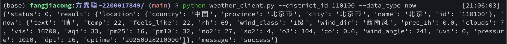
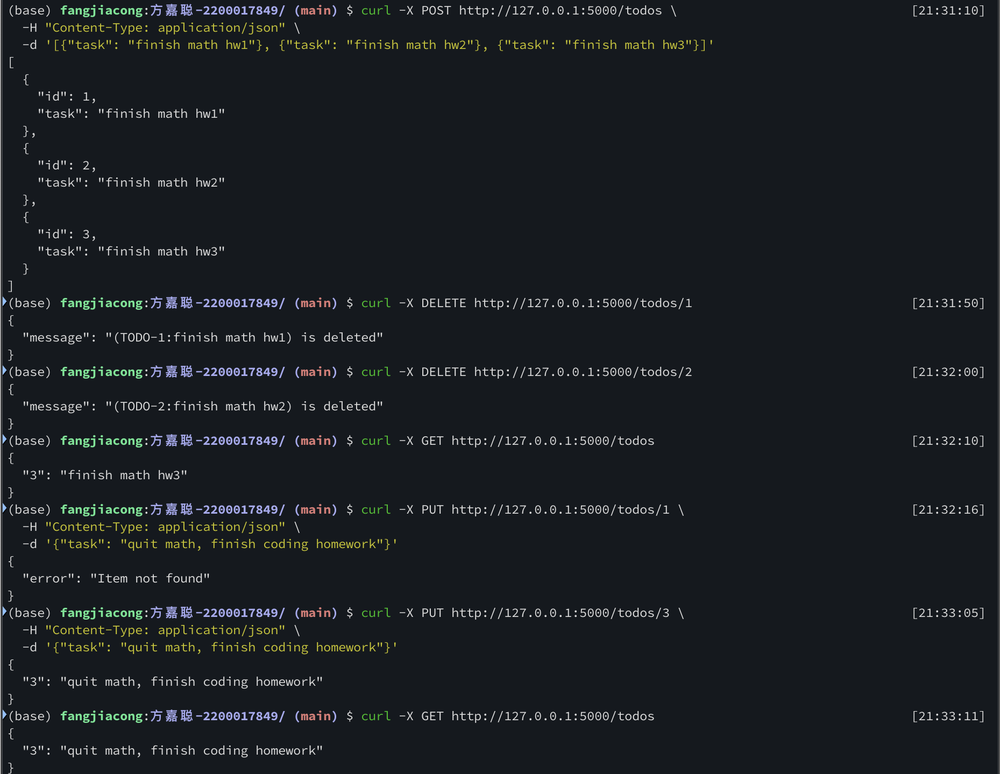

# Homework 2: REST API

**方嘉聪, 2200017849**

## 1. Weather Client

比较简单, `python weather_client.py -h` 查看用法. 



## 2. TODO-List API

```bash
python app.py   # 0. 启动服务器 `http://127.0.0.1:5000

curl -X GET http://127.0.0.1:5000/todos         # 1. 查看所有待办事项

curl -X POST http://127.0.0.1:5000/todos \      # 2. 添加一个/多个待办事项
  -H "Content-Type: application/json" \
  -d '[{"task": "description-1"}, {"task": "description-2"}]'

curl -X DELETE http://127.0.0.1:5000/todos/<id> # 3. 删除一个待办事项

curl -X PUT http://127.0.0.1:5000/todos/<id> \  # 4. 更新一个待办事项
  -H "Content-Type: application/json" -d '{"task": "new description"}'
```



#### 2.1 获取所有待办事项

- **Endpoint:** `/todos`
- **Method:** `GET`
- **参数:** 无
- **返回值:**  
  ```json
  {
    "1": "task1",
    "2": "task2"
  }
  ```
  返回所有待办事项，key 为任务 id，value 为任务内容。

#### 2.2 添加待办事项

- **Endpoint:** `/todos`
- **Method:** `POST`
- **参数:**  
  - 单个任务：  
    ```json
    {"task": "description"}
    ```
  - 多个任务：  
    ```json
    [
      {"task": "description-1"},
      {"task": "description-2"}
    ]
    ```
- **返回值:**  
  - 单个任务：
    ```json
    {"id": 1, "task": "description"}
    ```
  - 多个任务：
    ```json
    [
      {"id": 1, "task": "description-1"},
      {"id": 2, "task": "description-2"}
    ]
    ```

#### 2.3 删除待办事项

- **Endpoint:** `/todos/<id>`
- **Method:** `DELETE`
- **参数:**  
  - `id`：待删除任务的编号（URL 路径参数）
- **返回值:**  
  - 成功：
    ```json
    {"message": "(TODO-1:description) is deleted"}
    ```
  - 失败：
    ```json
    {"error": "Item not found"}
    ```

#### 2.4 更新待办事项

- **Endpoint:** `/todos/<id>`
- **Method:** `PUT`
- **参数:**  
  - `id`：待更新任务的编号（URL 路径参数）
  - 请求体：
    ```json
    {"task": "new description"}
    ```
- **返回值:**  
  - 成功：
    ```json
    {"1": "new description"}
    ```
  - 失败：
    ```json
    {"error": "Item not found"}
    ```

> Remarks: API使用文档由 GPT-4.1 生成, 再由个人进行校对修改.