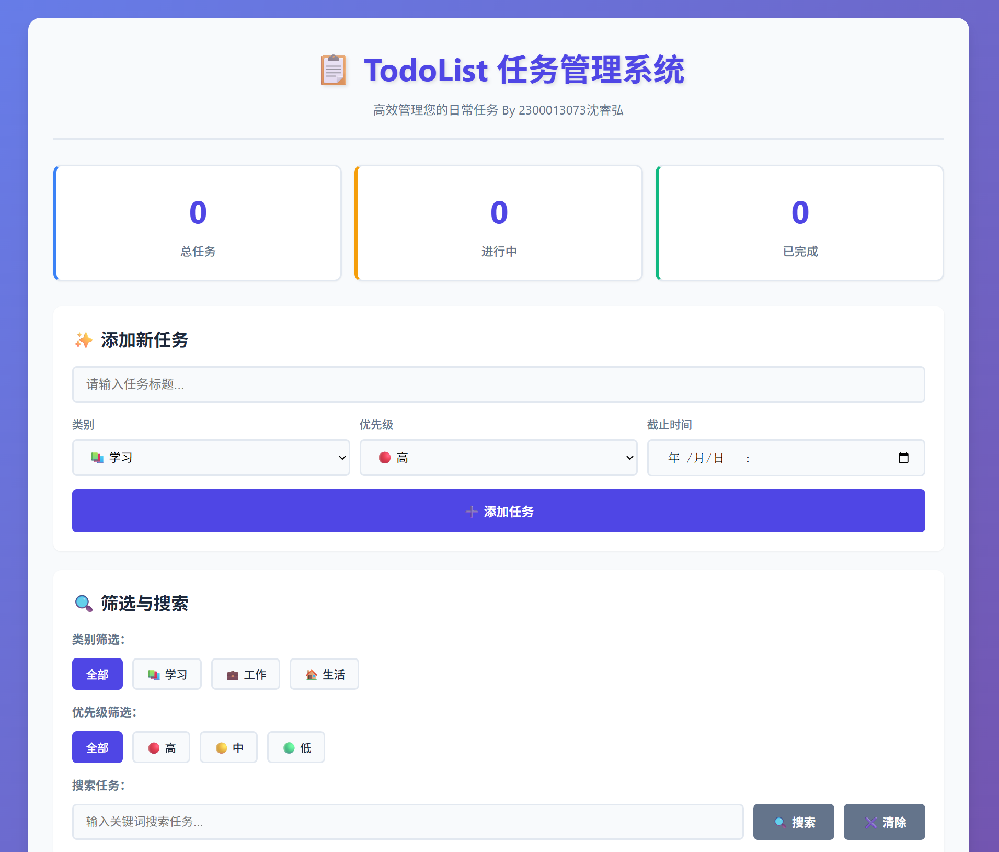
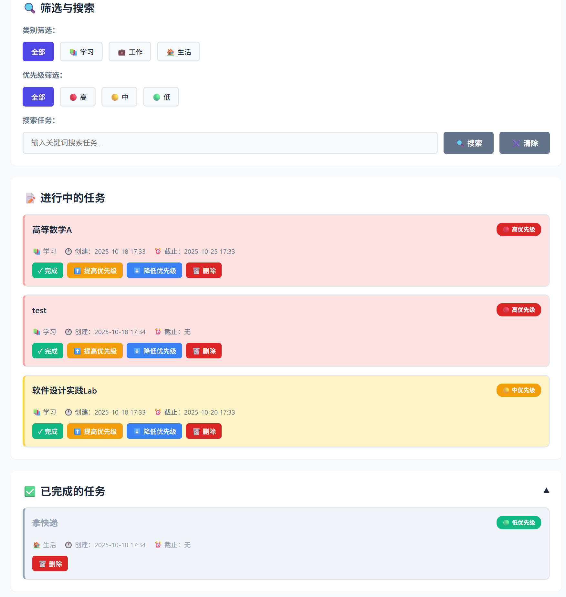
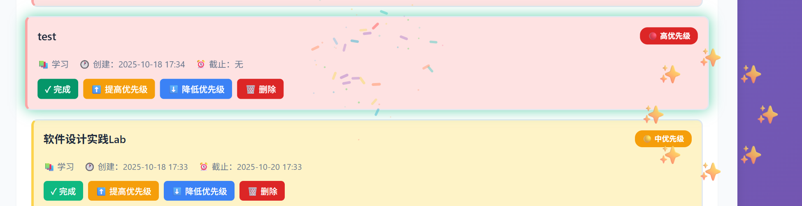

# TodoList 任务管理系统
## By 2300013073 沈睿弘 ISSE Homework3

## 🚀 启动系统

### 1. 启动后端服务
在项目目录下执行：
```bash
cd ./project
python app.py --host 0.0.0.0 --port 5000 --debug
```

### 2. 打开前端页面
使用 Python 启动简单的 HTTP 服务器：
```bash
cd ./project
python -m http.server 8080
```
然后访问：`http://localhost:8080/index.html`

> [!WARNING]
> 为了解决跨域请求的问题，使用了 flask-cors 库。使用 `pip install flask-cors` 安装。

---

## ✅ 功能列表



1. 添加新任务
2. 删除任务
3. 标记任务为完成
4. 按照分类筛选，按照优先级筛选
5. 智能按照紧急程度、截止时间等排序
6. 搜索指定的任务

## ✨ 额外功能说明

### 右上角提示系统
- 成功操作：绿色提示
- 错误操作：红色提示
- 警告信息：橙色提示
- 自动 3 秒后消失

### 动画效果
- 任务添加：滑入动画
- 任务删除：滑出动画
- 已完成区域：平滑展开/收起
- 已完成任务：播放烟花特效、醒目显示之后消失
- 按钮：悬停上移效果
- 卡片：悬停阴影效果

（删除的烟花特效示例如下）


### 排序规则
- **第一关键字**：优先级（高→中→低）
- **第二关键字**：截止时间（早→晚，无截止时间排最后）
- **第三关键字**：创建时间（早→晚）